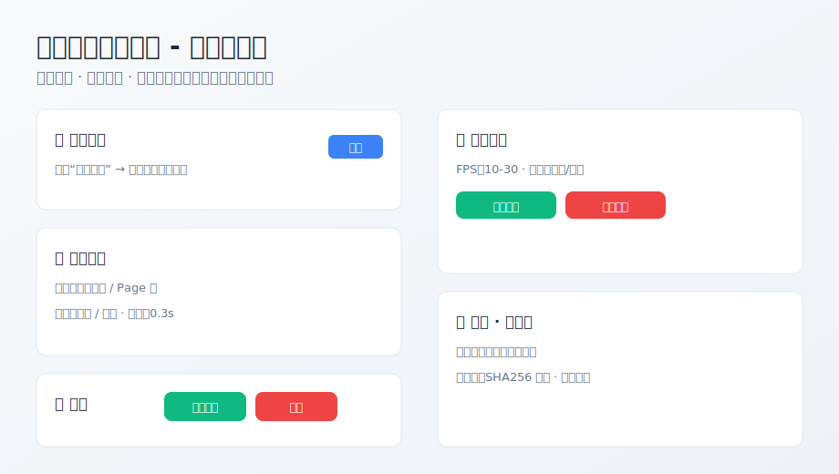

# 🚀 智能滚动截图工具 v3.0.6


专业的长页面滚动截图与区域录屏工具，支持自动滚动、防重复截图、证据链记录，适合微信聊天记录取证等场景。仅本地处理，数据不出机。

- 核心功能：滚动截图（Page/鼠标）、自动停止、区域录屏、证据链（SHA256）、微信窗口优化
- 运行环境：Windows 10/11，Python 3.7+



## 快速开始

1) 安装依赖

```bash
pip install -r requirements.txt
```

2) 启动程序

```bash
# 方式一：直接运行
python src/main.py

# 方式二：控制台脚本（安装后）
smart-screenshot
```

3) 基本使用
- 点击“选择区域”，拖拽需要截图的区域
- 选择滚动模式（鼠标滚轮 或 Page键）和方向
- 点击“开始截图”；可选勾选“纯滚动模式（不截图）”
- 录屏：在“屏幕录制”卡片设置 FPS、选择“选定区域/全屏”，再开始/停止

4) 输出
- 截图保存在你设置的保存目录（默认在项目上一层目录下“微信聊天记录”）
- 录制视频保存在 保存目录/录制视频/

## 文档
- 本页即简明使用文档

## 隐私与合规
- 全程本地处理，不上传任何截图/视频
- 支持证据链记录与SHA256完整性校验（详见界面提示）

## 许可证
MIT License
